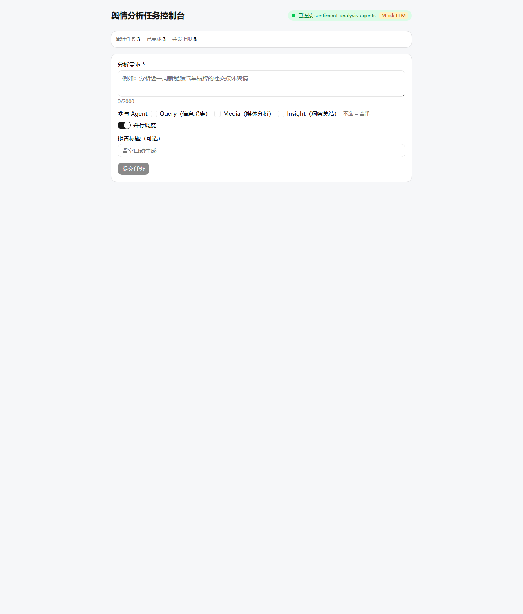
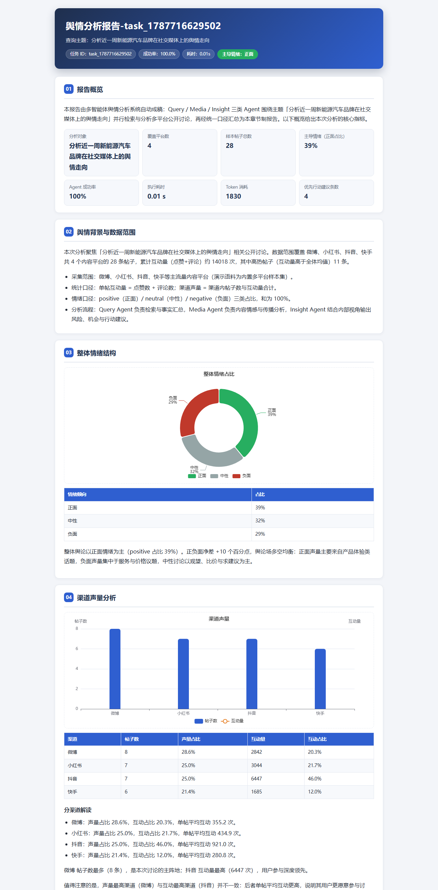

# 多智能体舆情分析系统

> [English](README.md) | 简体中文

面向公开舆情的 AI 多智能体系统：Query、Media、Insight 三个 Agent 经自定义调度器并行协作，完成采集、分析与报告生成；长耗时任务通过 SSE 推送实时进度。


[](https://github.com/zeng-bohan/sentiment-analysis-agents/actions/workflows/ci.yml)

## 亮点

- **并行分析**：Query、Media、Insight 三个 Agent 共享 `AgentContext`，由自研 `ForumEngine` 调度器统一编排。
- **工具调用**：检索、文档解析、数据库查询、情感分析等工具注册为 function calling。
- **长任务控制**：任务排队、并发限制、进度事件、可重连 SSE 流与 Redis 快照。
- **报告产出**：HTML / Markdown / PDF 三种格式。
- **韧性设计**：工具级与 Agent 级重试；未配置 LLM API Key 时自动走 `MockLLM` 离线路径。
- **可观测**：评测脚本、可选 LangSmith 追踪、Token 成本统计。

实测结果：265 次真实 LLM 工具调用全部成功；60 个离线 `MockLLM` 任务并发基准全部完成；真实 LLM 并行调度将 P95 从 66.2s 降至 30.3s；真实 LLM 单任务平均成本 0.054 元。

## 技术栈

| 层 | 技术 |
| --- | --- |
| 后端 | Python 3.11+、FastAPI、LangChain、SQLAlchemy（异步） |
| 前端 | React 19、Vite、TypeScript、shadcn/ui、ECharts |
| 存储 | PostgreSQL、Redis、SQLite（离线模式） |
| 报告 | HTML / Markdown / PDF 报告引擎、ECharts 图表 |
| 基础设施 | Docker Compose、GitHub Actions CI、LangSmith 追踪（可选） |

## 架构

```text
POST /v1/tasks
  -> TaskManager: 任务队列、信号量、SSE 进度、Redis 快照
  -> ForumEngine: Query + Media + Insight 三个 Agent
  -> ReportEngine: HTML / Markdown / PDF
  -> 状态查询、事件流与报告下载端点
```

## 快速开始

### 1. 创建环境

```bash
# Windows
python -m venv .venv
.venv\Scripts\python -m pip install -r requirements.txt
copy .env.example .env

# macOS / Linux
python3 -m venv .venv
.venv/bin/python -m pip install -r requirements.txt
cp .env.example .env
```

`LLM_API_KEY` 是可选的。留空即走离线 `MockLLM` 路径。

### 2. 启动服务

任选一种模式：

```bash
# Docker 全栈部署：API + PostgreSQL + Redis
docker compose up -d --build

# 本地开发（需自行启动 PostgreSQL 与 Redis）
# Windows: .venv\Scripts\python -m uvicorn app.main:app --port 8000
# macOS / Linux: .venv/bin/python -m uvicorn app.main:app --port 8000
```

离线本地运行可在 `.env` 中设置 `DATABASE_URL=sqlite+aiosqlite:///./sentiment.db`；Redis 不可用时自动降级为内存缓存。

### 3. 提交任务

```bash
curl -X POST http://localhost:8000/v1/tasks \
  -H "Content-Type: application/json" \
  -d '{"query":"分析新品手机「星云 X1」近期的口碑舆情"}'

curl -N http://localhost:8000/v1/tasks/<task_id>/events
curl -o report.html http://localhost:8000/v1/reports/<task_id>?fmt=html
```

### 4. 任务控制台（Web UI）

`frontend/` 内置 React 单页控制台——提交任务、实时查看 SSE 进度时间线、取消运行、阅读带 Token/成本徽标的 Markdown 报告。

```bash
cd frontend
npm install
npm run dev        # http://localhost:5173，代理到 :8000（无需配置 CORS）
```

先启动后端（Mock LLM 无需 API Key）。后端可达时控制台显示绿色「已连接」徽标。



生成的报告是一份 12 章文档，含 ECharts 情感与渠道声量图表、Agent 深挖卡片、风险/机会要点与全文跟帖附录——可从控制台或 `/v1/reports/{id}` 以 HTML / Markdown / PDF（10+ 页）获取。



## API

| 方法 | 路径 | 说明 |
| --- | --- | --- |
| POST | `/v1/tasks` | 提交任务并获取 `task_id`。 |
| GET | `/v1/tasks/{id}` | 读取任务状态与进度。 |
| GET | `/v1/tasks/{id}/events` | SSE 任务进度流。 |
| POST | `/v1/tasks/{id}/cancel` | 取消排队中或运行中的任务。 |
| GET | `/v1/stats` | 读取任务统计。 |
| GET | `/v1/reports/{id}?fmt=html\|md\|pdf` | 下载报告。 |
| GET | `/health` | 健康检查。 |

## 评测与测试

```bash
python scripts/build_eval_set.py
python scripts/evaluate.py --limit 60 --parallel
python scripts/bench.py --concurrency 60 --tasks 60
pytest tests -q
```

实测于当前版本：21 个测试全部通过；总体覆盖率 73%，Agent 层 85-100%，两个引擎层 84-98%。

## 项目结构

```text
app/
├── main.py
├── agents/       # Query、Media、Insight Agent 与工具
├── engines/      # ForumEngine 与 ReportEngine
└── core/         # LLM、缓存、数据库、任务管理、可观测
scripts/          # 数据集构建、评测与基准
tests/            # pytest 测试套件
docker-compose.yml
```

## 生产部署说明

- 配置 `LLM_API_KEY`（DeepSeek 或 OpenAI 兼容服务商）即可启用真实 function-calling 运行。
- 当前工具数据源为演示数据，可替换为生产级爬虫与数据库。
- 开发环境使用 `create_all` 建表；生产 schema 请使用 Alembic 或等价迁移工具。
- 配置 `LANGSMITH_API_KEY` 可启用可选的链路追踪上报。

## License

[MIT](LICENSE)
