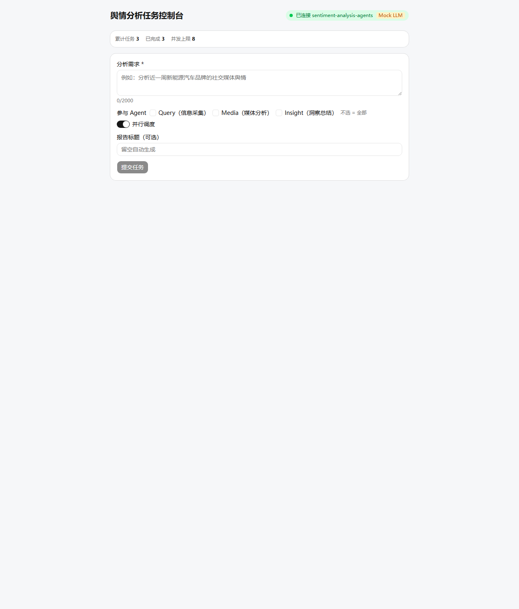
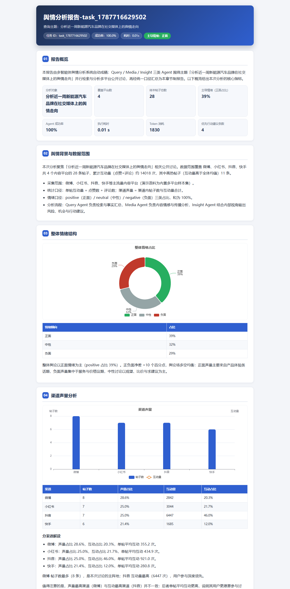
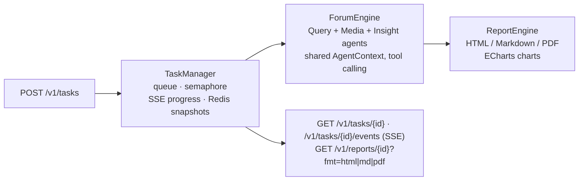

<p align="center">
  
</p>

<h1 align="center">多智能体舆情分析</h1>

<p align="center">
  面向公开舆情的采集、分析与报告 AI 多智能体系统 — Query、Media、Insight 三个智能体在自研调度器下并行工作，长任务进度通过 SSE 推送。
</p>

<p align="center">
  <a href="README.md">English</a> | 简体中文
</p>


[](https://github.com/zeng-bohan/sentiment-analysis-agents/actions/workflows/ci.yml)


## 核心特性

- **并行分析**：Query、Media、Insight 三个智能体共享 `AgentContext`，在自研 `ForumEngine` 调度器下执行。
- **工具调用**：检索、文档解析、数据库查询、舆情分析等工具注册为 function calling。
- **长任务控制**：任务排队、并发上限、进度事件、可重连 SSE 流、Redis 快照。
- **报告产出**：生成 HTML、Markdown、PDF 三种报告。
- **韧性**：工具级与智能体级重试；未配置 LLM API key 时自动切换 `MockLLM`。
- **可观测**：评估脚本、可选 LangSmith 追踪、token 成本核算。

真实运行实测：

| 实测项 | 结果 |
| --- | --- |
| 真实 LLM 工具调用完成数 | **265** |
| P95 任务时延（并行调度） | 66.2s → **30.3s** |
| 单任务平均真实 LLM 成本 | **0.054 元** |
| 离线并发基准 | 60 个 `MockLLM` 任务全部完成 |

## 技术栈

| 层 | 技术 |
| --- | --- |
| 后端 | Python 3.11+、FastAPI、LangChain、SQLAlchemy (async) |
| 前端 | React 19、Vite、TypeScript、shadcn/ui、ECharts |
| 存储 | PostgreSQL、Redis、SQLite（离线模式） |
| 报告 | HTML / Markdown / PDF 报告引擎、ECharts 图表 |
| 基础设施 | Docker Compose、GitHub Actions CI、可选 LangSmith 追踪 |

## 演示

React 任务控制台 — 提交任务、查看 SSE 实时进度时间线、取消运行、阅读带 token/成本角标的 Markdown 报告：



生成的报告是一份 12 章文档，含 ECharts 舆情与渠道声量图表、智能体深挖卡片、风险/机会标注和完整帖子附录 — 可从控制台或 `/v1/reports/{id}` 以 HTML / Markdown / PDF（10+ 页）获取：



## 架构


```mermaid
flowchart LR
    T["POST /v1/tasks"] --> TM["TaskManager<br/>queue · semaphore<br/>SSE progress · Redis snapshots"]
    TM --> FE["ForumEngine<br/>Query + Media + Insight agents<br/>shared AgentContext, tool calling"]
    FE --> RE["ReportEngine<br/>HTML / Markdown / PDF<br/>ECharts charts"]
    TM --> E["GET /v1/tasks/{id} · /v1/tasks/{id}/events (SSE)<br/>GET /v1/reports/{id}?fmt=html|md|pdf"]
```

## 快速开始

### 1. 创建环境

```bash
# Windows
python -m venv .venv
.venv\Scripts\python -m pip install -r requirements.txt
copy .env.example .env

# macOS / Linux
python3 -m venv .venv
.venv/bin/python -m pip install -r requirements.txt
cp .env.example .env
```

`LLM_API_KEY` 可选。留空即走离线 `MockLLM` 路径。

### 2. 启动服务

两种模式任选：

```bash
# Docker 全栈部署：API + PostgreSQL + Redis
docker compose up -d --build

# 本地 API 开发（自行先起 PostgreSQL 和 Redis）
# Windows: .venv\Scripts\python -m uvicorn app.main:app --port 8000
# macOS / Linux: .venv/bin/python -m uvicorn app.main:app --port 8000
```

离线本地运行：在 `.env` 中设置 `DATABASE_URL=sqlite+aiosqlite:///./sentiment.db`。Redis 故障时自动降级为内存缓存行为。

### 3. 提交任务

```bash
curl -X POST http://localhost:8000/v1/tasks \
  -H "Content-Type: application/json" \
  -d '{"query":"分析新品手机「星云 X1」近期的口碑舆情"}'

curl -N http://localhost:8000/v1/tasks/<task_id>/events
curl -o report.html http://localhost:8000/v1/reports/<task_id>?fmt=html
```

### 4. 任务控制台（Web UI）

```bash
cd frontend
npm install
npm run dev        # http://localhost:5173，代理到 :8000（无需配置 CORS）
```

先启动后端（mock LLM 无需 API key）。后端可达时控制台显示绿色「已连接」角标。

## API

| 方法 | 路径 | 说明 |
| --- | --- | --- |
| POST | `/v1/tasks` | 提交任务，返回 `task_id`。 |
| GET | `/v1/tasks/{id}` | 查询任务状态与进度。 |
| GET | `/v1/tasks/{id}/events` | SSE 流式任务进度。 |
| POST | `/v1/tasks/{id}/cancel` | 取消排队中或运行中的任务。 |
| GET | `/v1/stats` | 任务统计。 |
| GET | `/v1/reports/{id}?fmt=html|md|pdf` | 下载报告。 |
| GET | `/health` | 健康检查。 |

## 评估与测试

```bash
python scripts/build_eval_set.py
python scripts/evaluate.py --limit 60 --parallel
python scripts/bench.py --concurrency 60 --tasks 60
pytest tests -q
```

实测版本 21 个测试全过。覆盖率集中在逻辑所在处：智能体层 85-100%，两个引擎 84-98%。

## 项目结构

```text
app/
├── main.py
├── agents/       # Query、Media、Insight 智能体与工具
├── engines/      # ForumEngine 与 ReportEngine
└── core/         # LLM、缓存、数据库、任务管理、可观测
frontend/         # React 19 任务控制台（SSE 进度、报告查看）
scripts/          # 数据集构建、评估与基准
tests/            # pytest 套件
docker-compose.yml
```

## 注意事项与避坑

- **没有 API key 也能跑。** `LLM_API_KEY` 可选 — 离线 `MockLLM` 路径可以端到端跑通全流程，测试套件用的也是它。
- **工具数据源是演示用的。** 可以替换为生产爬虫与真实数据库；不要把演示源当生产数据。
- **Schema 迁移。** Alembic 负责 schema：`alembic upgrade head`（Docker Compose 入口自动执行）。`create_all` 保留给快速本地/开发启动。用 `alembic check` 校验模型与迁移的漂移。
- **优雅降级是有意设计。** Redis 故障回退为内存缓存行为；SQLite（`sqlite+aiosqlite`）是受支持的本地数据库档位。
- **控制台代理。** 前端 dev server 把 `/api` 代理到 `:8000` — 无需配置 CORS；先启动后端。
- **追踪。** 配置 `LANGSMITH_API_KEY` 启用可选的链路追踪上报。

## 路线图

按优先级：把演示用的工具数据源替换为生产爬虫与真实数据库；为 React 任务控制台补 lint 与自动化测试（当前 21 个测试只覆盖后端）。

## 支持

Bug、问题与功能建议：[提 Issue](https://github.com/zeng-bohan/sentiment-analysis-agents/issues)。Bug 报告请附复现步骤与相关日志或响应体。

## 贡献

个人维护项目。欢迎提 Issue 反馈 Bug 与想法；代码改动请先开 Issue 对齐方案，再投入时间。

## 许可证

[MIT](LICENSE)
